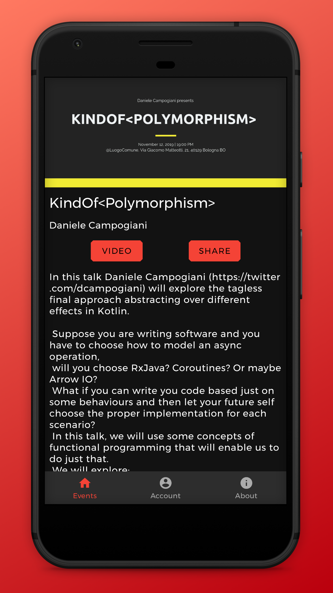

## How to build
    ./gradlew build

## How to create a new beta release
    git log --no-merges --format=%B | head -c 3276  >> CHANGELOG.txt
    ./gradlew assembleRelease appDistributionUploadRelease

This task is also run in Continuous Integration when a tag is pushed

## How to apply for beta testing

Just open a PR, updating the content of data/testers.txt

### Firebase Config
This app is using Firebase, hence to build it a _google-services.json_ is needed.

This file contains sensitive data and we can't keep it in the repo if you want to contribute please contact us.

An encrypted version of _google-services.json_ is added in the repo, in this way Travis can build the app for continuous integration.
